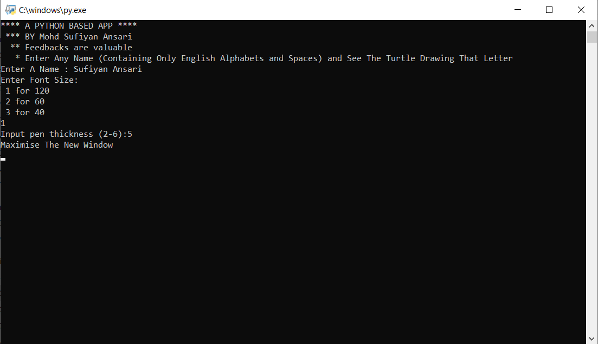
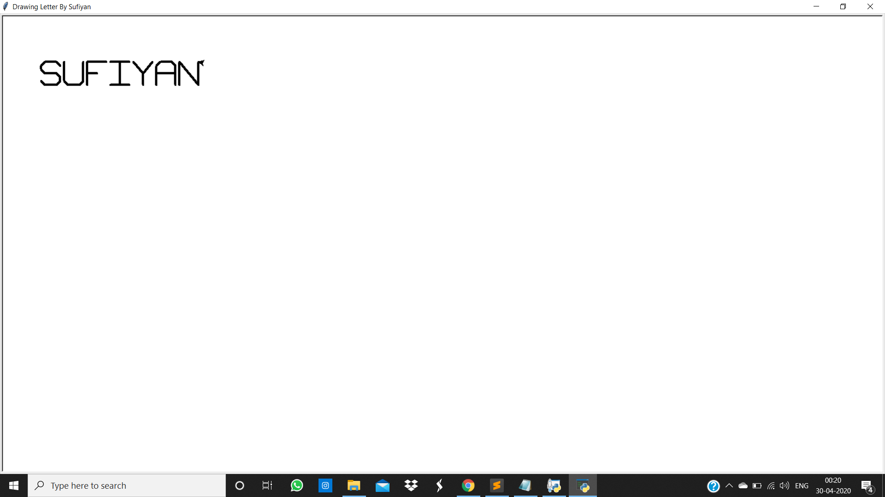
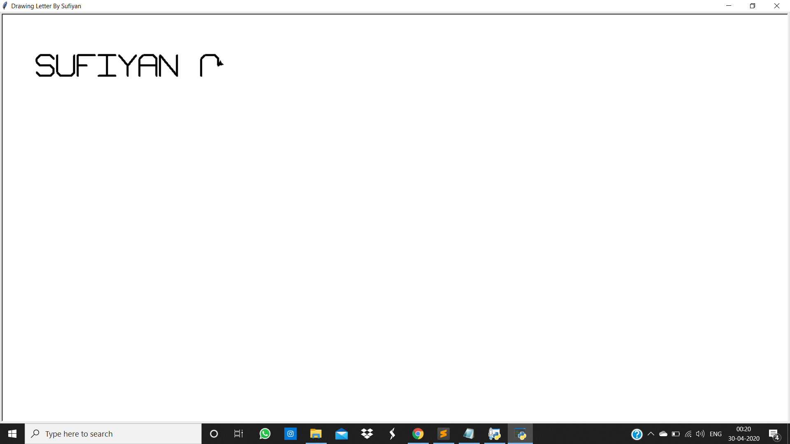
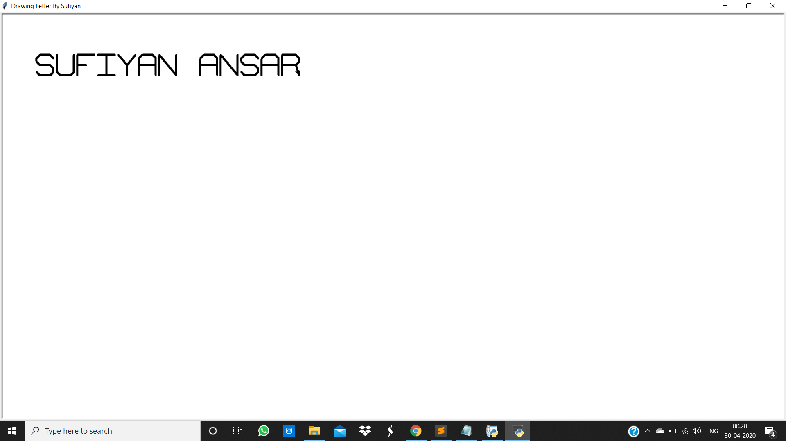
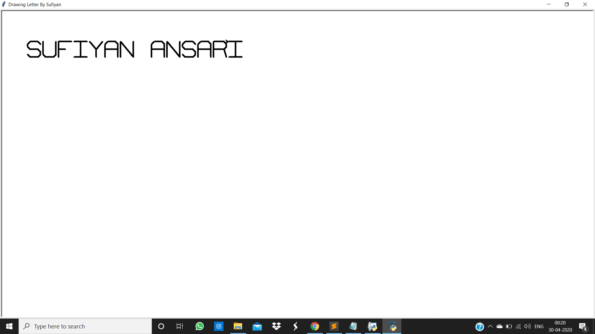

# Name Writer
### By Sufiyan Ansari

Using turtle library, this app draws the letters using bunch of codes written python language
just download both these files 
- [***main_file.py***](https://github.com/suffisme/NameWriter/blob/master/main_file.py)
- [***support.py***](https://github.com/suffisme/NameWriter/blob/master/support.py)

and run this command in the same directory from cmd or terminal

```
$ python main_file.py
```

or 

```sh
$ python3 main_file.py
```

### Caution:
- **Do Not Change the name of support.py file**
- **Do not change the imported methods and functions**

### Download The App
- If you dont have python or app that runs these above files
- Download the executable file from [Here](https://github.com/suffisme/NameApp)
- Inside the parent folder, run `Name_Writer.exe` file
### Enter the valid String

> Rule For Valid String:

> It should only contains
> alphabets and space.

> Moreover alphabets can
> be lowercase or
> upper case

# It will show like this:


## Enter These Requirements


### Note: 
- ***Output will be in uppercase only***
- ***Enter the correct font size and pen thickness***
- ***Maximise the screen to see the output***


#

#

#

#

